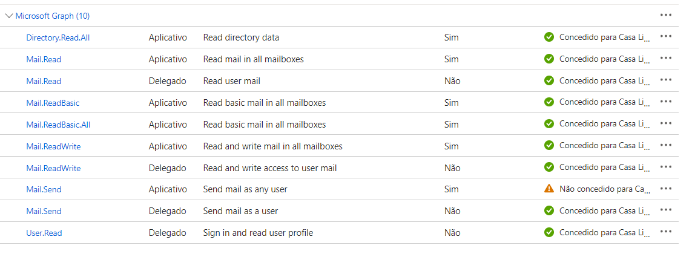

#Install

###Configure on Azure Active Directory
Register the application on the Azure Active Directory
https://learn.microsoft.com/pt-br/azure/active-directory/develop/quickstart-register-app

Set Permission to application
https://learn.microsoft.com/pt-br/azure/active-directory/develop/quickstart-configure-app-access-web-apis

 


###Run
```bash
npm install
```

```bash
cp .env.sample .env
```

Add Configurations to .env


And then

```bash
npm start
```